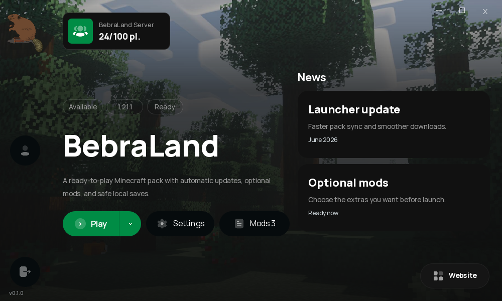

# BebraLand Launcher

A custom Minecraft launcher for BebraLand players.

It logs in through Azuriom, downloads the selected server pack, keeps local files in sync, supports optional mods, and starts Minecraft with the right mod loader, Java runtime, RAM settings, and authlib-injector setup.



## For Players

### What it does

- Logs in with your BebraLand/Azuriom account.
- Downloads Minecraft, the mod loader, and the server pack automatically.
- Updates only missing or changed files.
- Keeps your saves, screenshots, resource packs, shader packs, options, and server list safe.
- Lets you choose optional mods per pack.
- Saves RAM and window settings per profile.
- Auto-updates the launcher when a new release is available.
- Can launch an already downloaded pack offline if the backend is temporarily unavailable.

### Download

Windows players should download the latest installer from GitHub Releases:

```text
BebraLand-Launcher-Setup-windows-x64.exe
```

The installer creates Desktop and Start Menu shortcuts and installs the launcher into:

```text
%LOCALAPPDATA%\Programs\BebraLand Launcher
```

macOS and Linux builds are published as standalone launcher binaries. Keep the updater binary next to the launcher binary.

### First Launch

1. Open **BebraLand Launcher**.
2. Log in with your BebraLand account.
3. Pick a pack.
4. Adjust RAM or optional mods if you want.
5. Press **Play**.

The first launch can take a while because Minecraft, Java, mod loader files, and pack files may need to download. Later launches reuse the local cache.

### Local Files

Launcher data is stored in the native user data folder:

- Windows: `%APPDATA%\BebraLandLauncher`
- macOS: `~/Library/Application Support/BebraLandLauncher`
- Linux: `$XDG_DATA_HOME/BebraLandLauncher` or `~/.local/share/BebraLandLauncher`

Each pack has its own instance folder for mods, config, saves, screenshots, and options. Shared Minecraft assets, libraries, versions, Java runtime, mod loader installs, and authlib-injector are reused across packs.

### Pack Actions

- **Play**: syncs the selected pack and starts Minecraft.
- **Reinstall**: redownloads managed pack files, while keeping saves and user data.
- **Delete**: removes the selected local pack instance from this computer.
- **Mods**: enables or disables optional pack files.
- **Settings**: changes install folder, RAM, window mode, and debug options.

## For Developers

### Requirements

- Python `>=3.10,<3.14`
- [uv](https://docs.astral.sh/uv/)
- Windows builds: Windows x64 is the practical target for PySide6 and modern modded Minecraft.
- Windows installer builds: [Inno Setup 6](https://jrsoftware.org/isinfo.php)

### Run Locally

```powershell
cd "C:\Users\aurum\Desktop\custom bebraland launcher\BebraLand Launcher Frontend"
$env:UV_CACHE_DIR = "$PWD\.uv-cache"
$env:UV_PYTHON_INSTALL_DIR = "$PWD\.uv-python"
uv sync
uv run bebraland-launcher
```

Default backend URL:

```text
http://127.0.0.1:8765
```

Local `.env` is supported:

```env
BEBRALAND_SERVER_URL=http://192.168.0.116:8765
```

OS environment variables override `.env`.

### Useful Environment Variables

| Variable | Purpose |
| --- | --- |
| `BEBRALAND_SERVER_URL` | Backend server URL. |
| `BEBRALAND_UPDATE_MANIFEST_URL` | Launcher update manifest URL. |
| `BEBRALAND_LAUNCHER_DIR` | Override launcher data folder. |
| `BEBRALAND_JAVA_PATH` / `BEBRALAND_JAVA_HOME` | Optional Java hint for admin/debug use. |
| `BEBRALAND_USE_SYSTEM_JAVA=0` | Disable system Java auto-detect. |
| `AUTHLIB_INJECTOR_JAR` | Force a local authlib-injector jar. |

Release builds bake `BEBRALAND_SERVER_URL` from the GitHub Actions repository secret with the same name. The workflow should fail packaging if that value is empty, malformed, or points to localhost.

### Build Launcher

Windows:

```powershell
.\build_frontend.bat
```

Git Bash, Linux, or macOS:

```sh
./build_frontend.sh
```

Legacy helper:

```powershell
.\scripts\build_exe.ps1
```

Outputs:

- Windows: `dist\BebraLandLauncher.exe`, `dist\BebraLandUpdater.exe`
- macOS/Linux: `dist/BebraLandLauncher`, `dist/BebraLandUpdater`

PyInstaller builds for the OS and CPU it runs on.

### Build Windows Installer

```powershell
.\build_setup.bat
```

Output:

```text
dist\BebraLand-Launcher-Setup.exe
```

### Release Flow

This repo includes `.github/workflows/release.yml`.

Preferred flow:

1. Open GitHub Actions.
2. Run **Release launcher**.
3. Enter the player-facing display version, for example `0.0.0.4`.
4. Leave `release_tag` empty unless a custom unique tag is needed.

The workflow publishes launchers, updaters, `latest.json`, and the Windows installer to GitHub Releases.

The launcher checks:

```text
https://github.com/<owner>/<repo>/releases/latest/download/latest.json
```

Update manifest fields:

- `display_version`: version shown to players.
- `update_id`: monotonic release number used to decide whether an update is newer.
- `version`: compatibility value for old launchers.
- `releases`: platform-specific binaries with URL and SHA256.

Platform IDs used by the default workflow:

- `windows-x64`
- `linux-x64`
- `macos-arm64`
- `macos-x64`

### Runtime Flow

When the user presses **Play**:

1. Frontend requests the latest profile manifest from the backend over WebSocket.
2. Backend rebuilds the manifest from the server profile folder.
3. Frontend installs or reuses Minecraft and the mod loader.
4. Frontend checks managed pack files by SHA256.
5. Missing or changed files download from backend `/files/...`.
6. Launcher downloads or reuses authlib-injector.
7. Minecraft starts with the selected RAM, profile, Azuriom token, and backend Yggdrasil metadata.

The launcher keeps `/api/v1/ws` open while running. Backend profile changes can update the pack list live.

### Backend Features Used

The launcher can consume these profile fields when the backend provides them:

- `recommended_ram_mb`
- `icon_url`
- `background_url`
- `optional_mods`
- sync modes: default, whitelist, blacklist
- profile runtime/mod loader metadata
- server status and news payloads

Azuriom auth, Skin API refresh/upload, and Yggdrasil metadata are handled through the backend.
